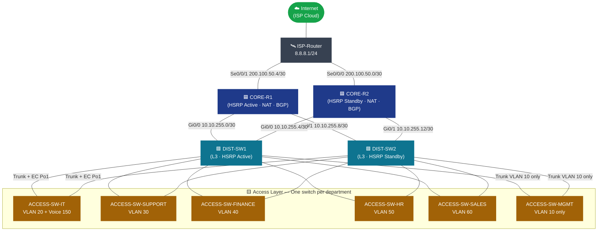
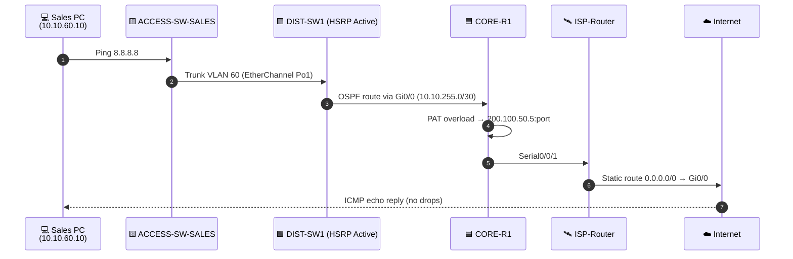
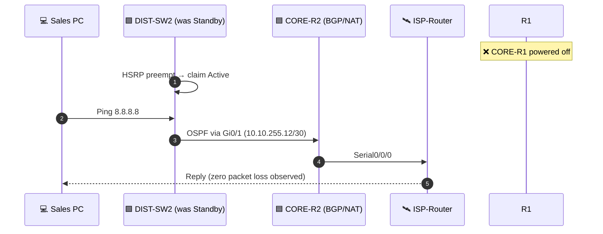
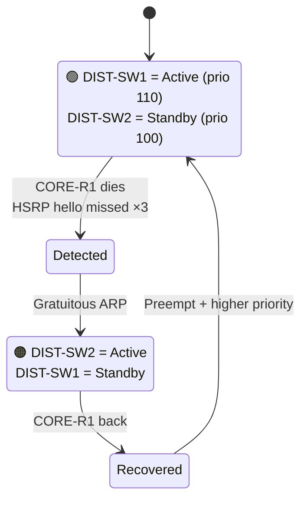
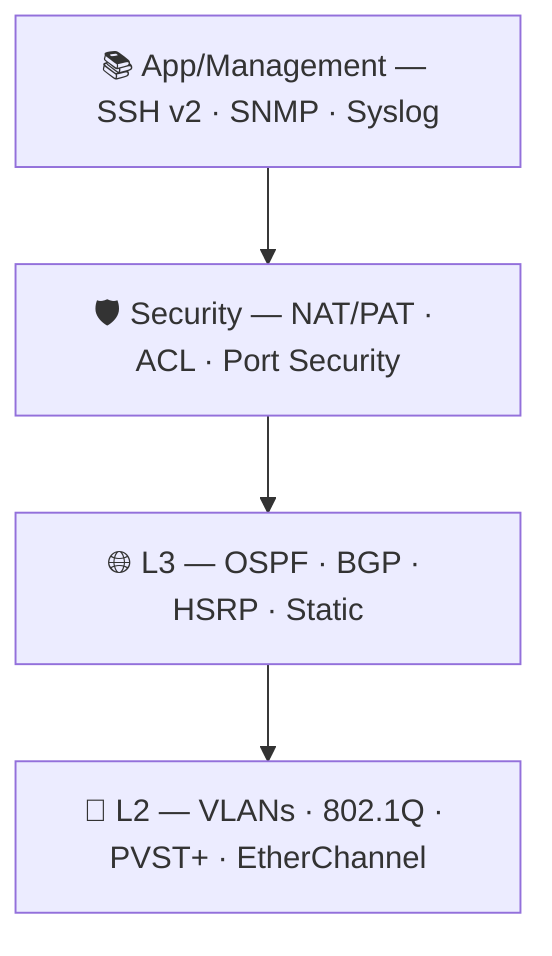

<div align="center">

<!-- ========================================================== -->
<!--  TOP BANNER                                                -->
<!-- ========================================================== -->


<br/>
<div align="center">

###  Tests Passed ·  CCNA-aligned · ⚡ Production-Ready

**🚀 [Quick Start](#-quick-start) · 📐 [Architecture](#-architecture-at-a-glance) · ✅ [Test Results](#-test-results)**

</div>
<!-- ========================================================== -->
<!--  BADGES                                                    -->
<!-- ========================================================== -->

[](#)
[](#)
[](#)
[](#)
[](#)
[](#)
[](LICENSE)
[](#)

<br/>

**Built by students, for students.**
A production-grade enterprise network — fully designed, configured, and verified in
**Cisco Packet Tracer**, with full redundancy (HSRP + dual core), dynamic routing
(OSPF), external edge (BGP + NAT/PAT), per-department segmentation (VLANs +
ACLs), and hardened access (Port Security, BPDU Guard, SSH v2).

</div>

---

<!-- ========================================================== -->
<!--  TABLE OF CONTENTS                                         -->
<!-- ========================================================== -->

## 📑 Table of Contents

1. [🎯 About the Project](#-about-the-project)
2. [🏗️ Architecture at a Glance](#️-architecture-at-a-glance)
3. [🌐 Topology Diagram](#-topology-diagram)
4. [🧰 Tech Stack](#-tech-stack)
5. [📐 IP Addressing Plan](#-ip-addressing-plan)
6. [🗂️ VLAN & Service Plan](#️-vlan--service-plan)
7. [🔁 Traffic Flow](#-traffic-flow)
8. [⚖️ HSRP Failover](#️-hsrp-failover)
9. [🧩 Protocol Stack](#-protocol-stack)
10. [📁 Repository Layout](#-repository-layout)
11. [🚀 Quick Start](#-quick-start)
12. [✅ Test Results](#-test-results)
13. [🧠 Challenges & Solutions](#-challenges--solutions)
14. [🛣️ Roadmap](#️-roadmap)
15. [👥 Authors](#-authors)
16. [🙏 Acknowledgements](#-acknowledgements)
17. [📄 License](#-license)

---

<!-- ========================================================== -->
<!--  1. ABOUT                                                  -->
<!-- ========================================================== -->

## 🎯 About the Project

**TechCom** is a fictional but realistic mid-sized telecom company whose
network we — two IT undergraduates at the **University of Ibb, Faculty of
Applied Science, Department of Information Technology** — designed from a
blank canvas as our graduation project.

It is not a toy. Every decision in the design answers a real business
question:

| Business need | Network answer |
|---|---|
| "Sales can't go down at 5 PM." | Dual core + HSRP + dual uplinks |
| "Finance data must be isolated." | Dedicated VLAN + trunk allow-list + ACL target |
| "We need phones, not just data." | Separate Voice VLAN 150 with HSRP |
| "We must reach the Internet." | BGP-style edge + NAT/PAT overload |
| "Plugging in a rogue switch must not break us." | PortFast + BPDU Guard on every access port |
| "Configuration must be auditable." | SSH v2, local user database, role-based exec |

> 🔬 **100% of the test cases passed** (see [`docs/TEST-RESULTS.md`](docs/TEST-RESULTS.md)).

---

<!-- ========================================================== -->
<!--  2. ARCHITECTURE AT A GLANCE                               -->
<!-- ========================================================== -->

<div align="center">

## 🏗️ Architecture at a Glance

</div>

```
                ┌──────────────────────────────────────────────────────────┐
                │                     ☁️  Internet / ISP                  │
                │                       ISP-Router (8.8.8.1)               │
                └──────────────┬──────────────────────────┬────────────────┘
                               │ Se0/0/0 200.100.50.0/30  │ Se0/0/1 200.100.50.4/30
                               │                          │
                ┌──────────────▼──────┐         ┌─────────▼────────────┐
                │  🟦  CORE-R2        │         │  🟦  CORE-R1          │
                │  HSRP Standby       │◄───────►│  HSRP Active          │
                │  NAT · BGP · OSPF   │         │  NAT · BGP · OSPF     │
                └──┬──────────────┬───┘         └──┬───────────────┬───┘
                   │ Gi0/0        │ Gi0/1          │ Gi0/0         │ Gi0/1
        10.10.255.4/30  │    10.10.255.12/30  │   10.10.255.0/30  10.10.255.8/30
                   │              │               │                 │
        ┌──────────▼────┐  ┌─────▼─────────┐ ┌───▼──────────┐  ┌──▼──────────┐
        │ 🟩 DIST-SW1   │  │ 🟩 DIST-SW2   │ │ 🟩 DIST-SW1  │  │ 🟩 DIST-SW2 │
        │  HSRP Active  │  │ HSRP Standby  │ │ HSRP Active  │  │ HSRP Standby│
        │  OSPF · SVIs  │  │ OSPF · SVIs   │ │ OSPF · SVIs  │  │ OSPF · SVIs │
        └──┬────────────┘  └───────┬───────┘ └──────┬───────┘  └──────┬──────┘
           │  Trunk + EtherChannel Po1             │                  │
           │                                       │                  │
   ┌───────┴────────────────────────────────────────┴──────────────────┴──────┐
   │                                                                           │
   │   🟨 ACCESS LAYER — One access switch per department                      │
   │                                                                           │
   │  ACCESS-SW-IT         (VLAN 20  + Voice 150)                              │
   │  ACCESS-SW-SUPPORT    (VLAN 30  + Voice 150)                              │
   │  ACCESS-SW-FINANCE    (VLAN 40  + Voice 150)                              │
   │  ACCESS-SW-HR         (VLAN 50  + Voice 150)                              │
   │  ACCESS-SW-SALES      (VLAN 60  + Voice 150)                              │
   │  ACCESS-SW-MANAGEMENT (VLAN 10  only — isolated)                          │
   │                                                                           │
   └───────────────────────────────────────────────────────────────────────────┘
```

> 📝 **Reading the diagram:** every arrow is a *physical* link. Logical
> relationships (HSRP, OSPF adjacency, EtherChannel) are noted on the link.

---

<!-- ========================================================== -->
<!--  3. TOPOLOGY DIAGRAM                                       -->
<!-- ========================================================== -->

<div align="center">

## 🌐 Topology Diagram

</div>



> 👉 **See also:** [`diagrams/02-traffic-flow.md`](diagrams/02-traffic-flow.md) ·
> [`diagrams/03-vlan-broadcast-domains.md`](diagrams/03-vlan-broadcast-domains.md) ·
> [`diagrams/04-hsrp-failover-state.md`](diagrams/04-hsrp-failover-state.md) ·
> [`diagrams/05-protocol-stack.md`](diagrams/05-protocol-stack.md)

---

<!-- ========================================================== -->
<!--  4. TECH STACK                                             -->
<!-- ========================================================== -->

## 🧰 Tech Stack

| Layer | Technology | Where |
|---|---|---|
| **Simulation** | Cisco Packet Tracer 8.x | `packet-tracer/` |
| **Routing** | OSPF (single-area), static, simulated BGP | Core + Distribution |
| **First-hop redundancy** | HSRP v1 (priority + preempt) | DIST-SW1/2 |
| **Switching** | 802.1Q, EtherChannel (LACP `active`), PVST+ | All switches |
| **Edge services** | NAT/PAT overload, ACL 1 | CORE-R1 / CORE-R2 |
| **Voice** | Voice VLAN 150 + DHCP helper | Access + Distribution |
| **Security** | SSH v2 (RSA-1024), `enable secret`, `login local` | All devices |
| **Hardening** | PortFast, BPDU Guard, trunk allow-lists | Every access port |
| **Documentation** | Markdown, Mermaid, PowerPoint, PDF | `docs/` |

---

<!-- ========================================================== -->
<!--  5. IP PLAN                                                -->
<!-- ========================================================== -->

## 📐 IP Addressing Plan

Full table lives in [`docs/IP-PLAN.md`](docs/IP-PLAN.md). TL;DR:

| Block | Purpose |
|---|---|
| `10.10.0.0/16` | All internal traffic |
| `10.10.10.0/24` … `10.10.150.0/24` | One `/24` per VLAN/department |
| `10.10.255.0/30` … `10.10.255.12/30` | Point-to-point core ↔ distribution |
| `200.100.50.0/30` … `200.100.50.4/30` | Public edge to ISP |
| `8.8.8.0/24` | Simulated Internet on ISP router |

**Department gateways (HSRP virtual IPs):**

| VLAN | Subnet | Gateway (HSRP) |
|---|---|---|
| 10 — Management | `10.10.10.0/24` | `10.10.10.1` |
| 20 — IT | `10.10.20.0/24` | `10.10.20.1` |
| 30 — Support | `10.10.30.0/24` | `10.10.30.1` |
| 40 — Finance | `10.10.40.0/24` | `10.10.40.1` |
| 50 — HR | `10.10.50.0/24` | `10.10.50.1` |
| 60 — Sales | `10.10.60.0/24` | `10.10.60.1` |
| 99 — Device-plane | `10.10.99.0/24` | `10.10.99.1` |
| 150 — Voice | `10.10.150.0/24` | `10.10.150.1` |

---

<!-- ========================================================== -->
<!--  6. VLAN PLAN                                              -->
<!-- ========================================================== -->

## 🗂️ VLAN & Service Plan

| VLAN ID | Name | Role |
|--:|---|---|
| 10  | Management | SVI / management plane (SSH, SNMP) |
| 20  | IT | IT department + Voice |
| 30  | Support | Technical support |
| 40  | Finance | Finance (ACL target) |
| 50  | HR | Human resources |
| 60  | Sales | Sales (QoS-ready) |
| 99  | Device-plane | Router ↔ switch protocol traffic |
| 100 | Native | Trunk native (must match on every link) |
| 150 | Voice (VoIP) | IP phones |

Full breakdown & rationale: [`docs/VLAN-PLAN.md`](docs/VLAN-PLAN.md)

---

<!-- ========================================================== -->
<!--  7. TRAFFIC FLOW                                           -->
<!-- ========================================================== -->

## 🔁 Traffic Flow

### Normal path — Sales PC → Internet



### Failover path — CORE-R1 dies



> 🔁 See [`diagrams/02-traffic-flow.md`](diagrams/02-traffic-flow.md) for the
> complete sequence diagrams including Finance → Sales inter-VLAN traffic.

---

<!-- ========================================================== -->
<!--  8. HSRP FAILOVER                                          -->
<!-- ========================================================== -->

## ⚖️ HSRP Failover



**Priority table:**

| VLAN | DIST-SW1 | DIST-SW2 |
|---:|---:|---:|
| 10, 20, 30, 40, 50, 60, 150 | **110** (Active) | 100 (Standby) |
| 99 (device-plane) | **110** | 90 (intentionally lowest) |

> 🎯 Full state machine: [`diagrams/04-hsrp-failover-state.md`](diagrams/04-hsrp-failover-state.md)

---

<!-- ========================================================== -->
<!--  9. PROTOCOL STACK                                         -->
<!-- ========================================================== -->

## 🧩 Protocol Stack



| Protocol | Where | Why |
|---|---|---|
| OSPF (Area 0) | Core + Distribution | Dynamic internal routing |
| BGP (sim.) | Core ↔ ISP | Realistic edge |
| HSRP v1 | DIST-SW1/2 | Gateway redundancy |
| NAT/PAT | CORE-R1/2 | Internet sharing |
| 802.1Q | All trunks | VLAN tagging |
| EtherChannel | Access ↔ Distribution | Aggregated GigE |
| PortFast + BPDU Guard | Every access port | Edge hardening |
| SSH v2 | All devices | Encrypted mgmt |

---

<!-- ========================================================== -->
<!--  10. REPO LAYOUT                                           -->
<!-- ========================================================== -->

## 📁 Repository Layout

```
TechCom-Network/
├── 📄 README.md                     ← you are here
├── 📄 LICENSE
├── 📄 .gitignore
│
├── 📁 packet-tracer/
│   └── Network Ayman & Alhareth.pkt ← the live lab
│
├── 📁 configs/
│   ├── 📁 configs-Router/
│   │   ├── CORE-R1.conf
│   │   └── CORE-R2.conf
│   ├── 📁 configs-Switch/
│   │   ├── DIST-SW1.conf
│   │   ├── DIST-SW2.conf
│   │   ├── ACCESS-SW-IT.conf
│   │   ├── ACCESS-SW-SUPPORT.conf
│   │   ├── ACCESS-SW-FINANCE.conf
│   │   ├── ACCESS-SW-HR.conf
│   │   ├── ACCESS-SW-SALES.conf
│   │   └── ACCESS-SW-MANAGEMENT.conf
│   └── 📁 configs-ISP/
│       └── ISP-Router.conf
│
├── 📁 diagrams/
│   ├── 01-architecture-overview.md   (3-tier Mermaid)
│   ├── 02-traffic-flow.md            (sequence diagrams)
│   ├── 03-vlan-broadcast-domains.md  (VLAN map)
│   ├── 04-hsrp-failover-state.md     (HSRP state machine)
│   └── 05-protocol-stack.md          (L2–L7 stack)
│
└── 📁 docs/
    ├── 📁 arabic/
    │   └── تقرير شبكة - TechCom.pdf   (original Arabic report)
    ├── IP-PLAN.md
    ├── VLAN-PLAN.md
    ├── TEST-RESULTS.md
    ├── CHALLENGES.md
    └── network_topology.pptx         (presentation slides)
```

---

<!-- ========================================================== -->
<!--  11. QUICK START                                            -->
<!-- ========================================================== -->

## 🚀 Quick Start

### ▶️ Run the lab

1. **Install** [Cisco Packet Tracer 8.x](https://www.netacad.com/courses/packet-tracer).
2. **Clone** this repository:
   ```bash
   git clone https://github.com/<your-username>/TechCom-Network.git
   cd TechCom-Network
   ```
3. **Open** the lab file:
   ```bash
   # Windows
   start "" "packet-tracer/Network Ayman & Alhareth.pkt"

   # macOS
   open "packet-tracer/Network Ayman & Alhareth.pkt"

   # Linux
   pktui "packet-tracer/Network Ayman & Alhareth.pkt"
   ```
4. **Wait** ~30 s for OSPF to converge, then run:
   ```text
   PC-Sales> ping 8.8.8.8
   PC-IT>    ping 10.10.60.10
   ```

### 📥 Apply a config to a real device

If you have a physical or virtual IOS device, push a single config:

```bash
# Example: copy a switch config to a TFTP server first, then merge
# via the device console / VTY.

# 1) From the device:
copy running-config tftp:
# 2) Replace the relevant section with the matching .conf file
```

Or use the lab as a **config reference** even on real gear — every command
is copy-pasteable from the `configs/` folder.

### 🔁 Reproduce a failover test

1. Open the lab.
2. From a Sales PC, run `ping -t 8.8.8.8`.
3. In Packet Tracer, **delete the power connection** to CORE-R1.
4. Observe: HSRP reconverges in < 5 s, ping stays green.

---

<!-- ========================================================== -->
<!--  12. TEST RESULTS                                           -->
<!-- ========================================================== -->

## ✅ Test Results

| # | Test | Expected | Result |
|---|---|---|---|
| 1 | Ping across VLANs | Inter-department reply | ✅ |
| 2 | Ping 8.8.8.1 | Internet via NAT | ✅ |
| 3 | Traceroute | Path: DIST → CORE → ISP | ✅ |
| 4 | HSRP failover | Zero packet loss on CORE-R1 fail | ✅ |
| 5 | BPDU Guard | Port err-disabled on rogue BPDU | ✅ |
| 6 | OSPF neighbors | Full adjacency | ✅ |

> 📋 Full breakdown with sample output: [`docs/TEST-RESULTS.md`](docs/TEST-RESULTS.md)

---

<!-- ========================================================== -->
<!--  13. CHALLENGES                                             -->
<!-- ========================================================== -->

## 🧠 Challenges & Solutions

| # | Challenge | Fix |
|---|---|---|
| 1 | Duplicate SVI IPs between DIST-SW1/2 | Split addresses + HSRP virtual IP |
| 2 | HSRP Active/Standby flap | Set priority 110 + preempt, verify failover |
| 3 | Native VLAN mismatch | Standardise on VLAN 100, audit every trunk |
| 4 | Inter-VLAN silently broken | Enable `ip routing`, build SVIs, validate with ping |
| 5 | NAT inside/outside reversed | Re-tag interfaces, rebuild ACL 1 |
| 6 | VoIP one-way | Unify VLAN 150, HSRP, `switchport voice vlan 150` |
| 7 | SPOF on distribution layer | Add DIST-SW2 + EtherChannel, validate failover |

> 📚 Full war stories: [`docs/CHALLENGES.md`](docs/CHALLENGES.md)

---

<!-- ========================================================== -->
<!--  14. ROADMAP                                                -->
<!-- ========================================================== -->

## 🛣️ Roadmap

- [x] Three-tier topology with full L2/L3 redundancy
- [x] OSPF + simulated BGP + HSRP
- [x] Per-department VLANs + Voice VLAN 150
- [x] Port Security + BPDU Guard
- [x] EtherChannel access uplinks
- [x] SSH v2 across the fabric
- [x] 100% test pass on failover / inter-VLAN / Internet
- [ ] Add real ACL examples for Finance ↔ others
- [ ] Add SNMPv3 + NetFlow collector config
- [ ] Port to GNS3 / EVE-NG for hypervisor lab
- [ ] Add QoS policy template for Voice VLAN 150
- [ ] CI workflow: validate `.conf` syntax on every PR

---

<!-- ========================================================== -->
<!--  15. AUTHORS                                                -->
<!-- ========================================================== -->

## 👥 Authors

<table>
<tr>
<td align="center" width="50%">
<br/>
<sub><b>Alhareth Hayel Al-Dahiah</b></sub><br/>
<sub>Network Design · Routing · Switching</sub><br/>
<sub>📧 <i>available on request</i></sub>
</td>
<td align="center" width="50%">
<br/>
<sub><b>Ayman Bashi Al-Baidhani</b></sub><br/>
<sub>Architecture · Security · Documentation</sub><br/>
<sub>📧 <i>https:/github/ayman-albaidahi</i></sub>
</td>
</tr>
</table>

**Supervisor:** Dr. Salma Hammoud — *University of Ibb, Faculty of Applied Science, Department of Information Technology*

---

<!-- ========================================================== -->
<!--  16. ACKNOWLEDGEMENTS                                       -->
<!-- ========================================================== -->

## 🙏 Acknowledgements

* **University of Ibb** — for the lab time and the freedom to break things
  and rebuild them better.
* **Dr. Salma Hammoud** — for the steady hand on the steering wheel.
* **Cisco Networking Academy** — for Packet Tracer.
* The open-source community — for Mermaid, Markdown, and the beautiful
  shields that make a README shine.

---

<!-- ========================================================== -->
<!--  17. LICENSE                                                -->
<!-- ========================================================== -->

## 📄 License

Released under the **MIT License**. See [`LICENSE`](LICENSE) for the full text.
You are free to use, modify, and distribute, provided attribution is kept.

---

<div align="center">

**⭐ Star this repo if it helped you design, study, or pass an exam ⭐**

<br/>


</div>
<div align="center">

### ⭐ If this helped you, give it a star!

**Made with ❤️ in Yemen — University of Ibb**

</div>
