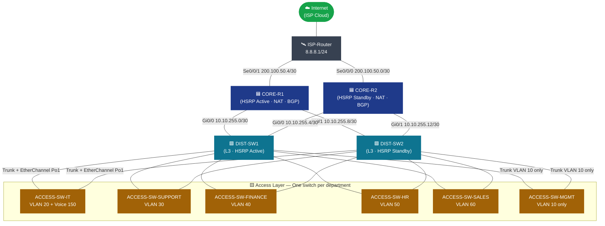

# 🌐 Architecture Overview

> High-level topology of the **TechCom** enterprise network — three-tier
> (Core / Distribution / Access) with redundant uplinks, HSRP, OSPF, and
> dual-homed ISP connectivity.

## 📐 Three-Tier Diagram (Mermaid)

## 🧱 Layer Responsibilities

| Layer | Devices | Responsibility |
|---|---|---|
| 🌐 **Internet / ISP** | ISP-Router | Static-route traffic sink + dual serial uplinks |
| 🟦 **Core** | CORE-R1, CORE-R2 | NAT/PAT, BGP with ISP, OSPF area 0, HSRP with distribution |
| 🟩 **Distribution** | DIST-SW1, DIST-SW2 | Inter-VLAN routing (L3 SVIs), HSRP virtual gateways, OSPF peering |
| 🟨 **Access** | 6 × ACCESS-SW-* | Department segmentation, port security, BPDU Guard, VoIP tagging |

## 🔁 Redundancy Strategy

* **Two core routers** — every distribution switch has a link to **both**
  cores. Loss of either core is invisible to end users (HSRP failover).
* **Two distribution switches** — every access switch uplinks to **both**
  distribution switches via separate trunks + an EtherChannel on the
  GigE ports.
* **Two serial uplinks to ISP** — equal-cost static routes from ISP into
  the customer space mean no single-link outage.
