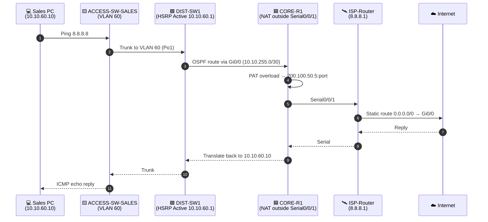
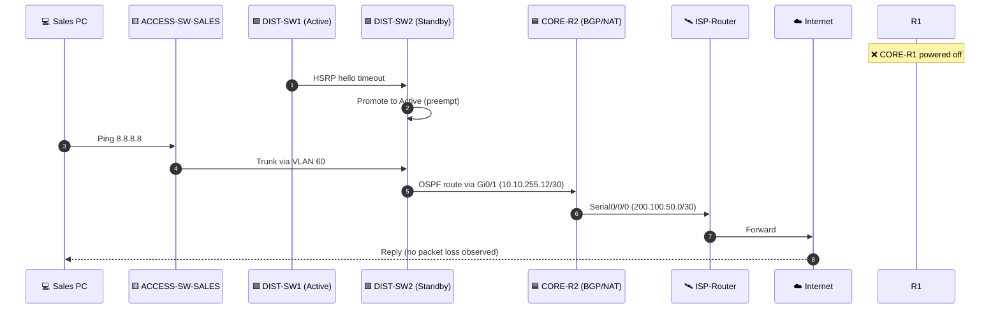
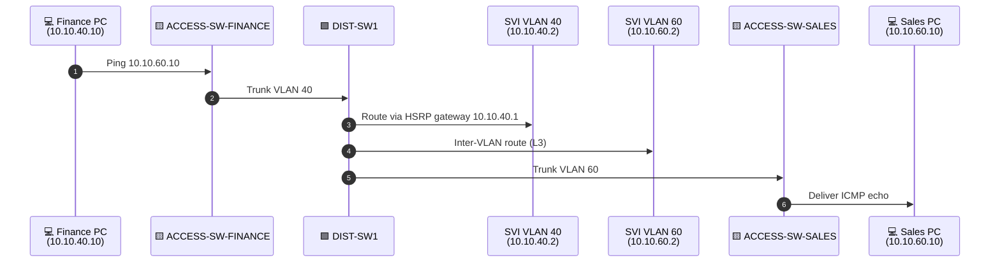

# 🔄 Traffic Flow — End-to-End

> How a packet moves from **PC-Sales** to the **Internet (8.8.8.8)** and back,
> plus how it stays alive when **CORE-R1** dies.

## 📊 Normal Path — Sales PC → Internet

## 🚨 Failover Path — CORE-R1 dies

## 🛰️ Inter-VLAN Path — Finance → Sales (L3 in Distribution)

