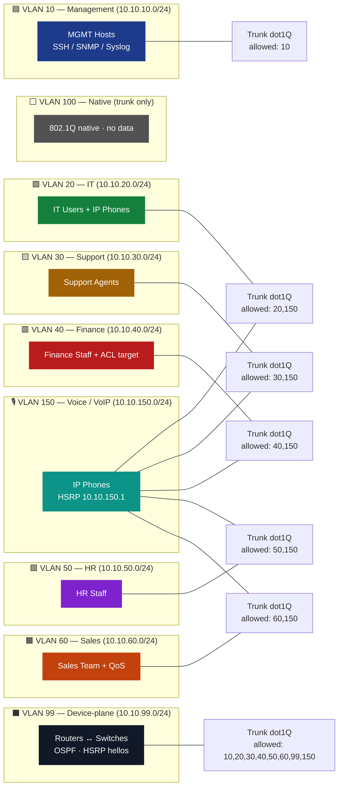

# 🗺️ VLAN Broadcast Domains

> A picture of every broadcast domain in the network, who owns it, and how
> it crosses the trunk fabric.

## 🎨 Domain Map

## 🔒 Trunk Allow-Lists (defence-in-depth)

| Trunk | Native | Allowed VLANs |
|---|---|---|
| DIST ↔ Access (data) | 100 | `20,30,40,50,60,150` |
| DIST ↔ Access (mgmt) | 100 | `10` *(only)* |
| DIST internal / to core | 100 | `10,20,30,40,50,60,99,150` |

> 🚫 **VLAN hopping blocked**: every trunk enumerates exactly which VLANs are
> permitted, instead of the dangerous default of *all*.
