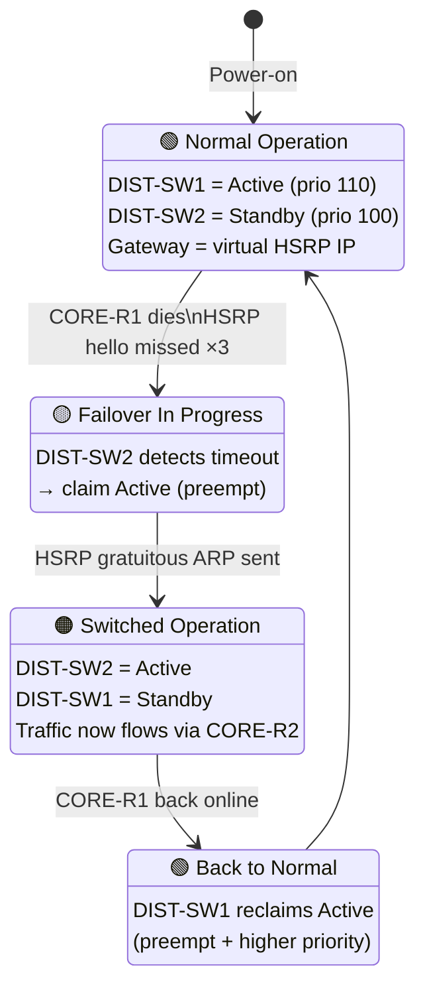

# ⚖️ HSRP Failover — State Machine

> How the gateway role migrates between DIST-SW1 (Active) and DIST-SW2
> (Standby) when a core router dies.

## 🧮 HSRP Priority Table

| VLAN | DIST-SW1 | DIST-SW2 | Active |
|------|---------:|---------:|--------|
| 10   | **110**  | 100      | DIST-SW1 |
| 20   | **110**  | 100      | DIST-SW1 |
| 30   | **110**  | 100      | DIST-SW1 |
| 40   | **110**  | 100      | DIST-SW1 |
| 50   | **110**  | 100      | DIST-SW1 |
| 60   | **110**  | 100      | DIST-SW1 |
| 99   | **110**  | 90       | DIST-SW1 |
| 150  | **110**  | 100      | DIST-SW1 |

> VLAN 99 intentionally has DIST-SW2 at **priority 90** — lowest of the
> bunch — so the device-plane gateway never flaps during routine
> reconvergence.
