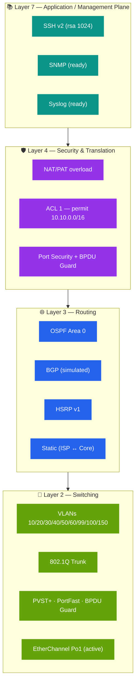

# 🧩 Protocol Stack

> Every protocol that runs in the network and on which layer of the topology.

## 🗃️ Where each protocol lives

| Protocol | Where it runs | Purpose |
|----------|---------------|---------|
| OSPF | CORE-R1, CORE-R2, DIST-SW1, DIST-SW2 | Dynamic internal routing |
| BGP | CORE-R1, CORE-R2 ↔ ISP | Simulated external routing |
| HSRP | DIST-SW1, DIST-SW2 | First-hop gateway redundancy |
| NAT/PAT | CORE-R1, CORE-R2 | Internet address sharing |
| 802.1Q | All trunks | VLAN tagging |
| PVST+ | All switches | Per-VLAN spanning tree |
| PortFast | Access ports | Fast edge transition |
| BPDU Guard | Access ports | Stops rogue switches |
| EtherChannel | Access ↔ Distribution | Aggregated GigE uplinks |
| SSH v2 | All managed devices | Encrypted management |
